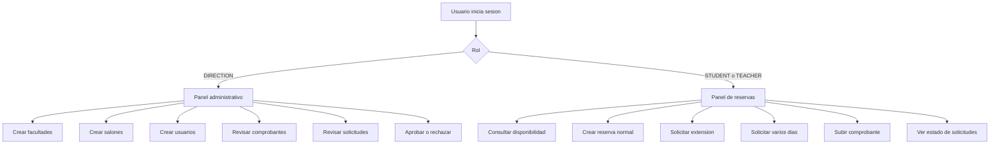

# Sistema de Reservas Academicas
este flujo tiene como objetivo reservar aquellos salones segun esten disponibles, si en caso dado el usuario deseea una extencio de dias/horas se realiza una solicitud hacia direccion, haciendo que esta misma rechaze u apruebe las solicitudes de igual manera se hace una validacion y extracion de datos a partir de la imagen de comprobante usando un modelo LLM (Anthropic). 

# Diagrama General 

## Servicios y puertos 

- Frontend: `http://localhost:3000`
- API health: `http://localhost:3001/health`
- RabbitMQ management: `http://localhost:15672`

